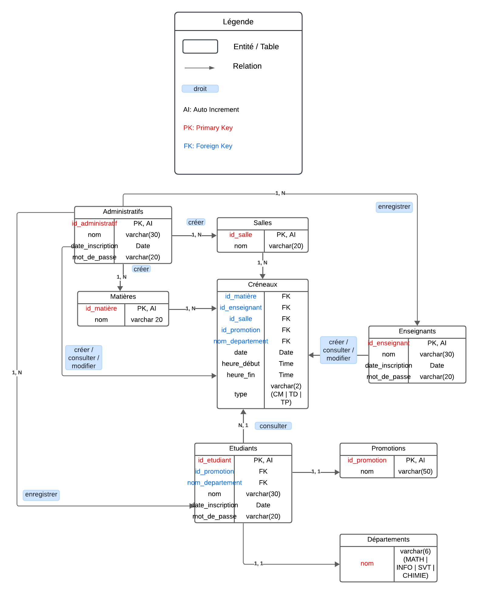

# Jean Perrin Planning (JPP)

```bash
sudo /opt/lampp/manager-linux-x64.run
```

## Required Tech Stack and Config

```bash
$ php -v
PHP 8.1.2-1ubuntu2.14 (cli) (built: Aug 18 2023 11:41:11) (NTS)
Copyright (c) The PHP Group
Zend Engine v4.1.2, Copyright (c) Zend Technologies
    with Zend OPcache v8.1.2-1ubuntu2.14, Copyright (c), by Zend Technologies
```

```bash
# To be enable writing on sqlite database file, with it's parent folders, they should have the necessary permission
$ chmod 775 jpp
/jpp$ chmod 775 src
/jpp/src$ chmod 777 sqlite
/jpp/src/sqlite$ chmod 777 planning.db

# sudo chown -R john src # To recursively set john as owner of src folder
```

```bash
$ sqlite3 --version
3.37.2 2022-01-06 13:25:41 872ba256cbf61d9290b571c0e6d82a20c224ca3ad82971edc46b29818d5dalt1
```

```bash
$ sqlite3 planning.db
SQLite version 3.37.2 2022-01-06 13:25:41
Enter ".help" for usage hints.
sqlite> .tables
administratifs  departements    etudiants       promotions
crenaux         enseignants     matieres        salles
```

```bash
# One of the interesting outputs format is tabular one (box, markdown, table)
# ex.: To display administratifs table content in box format:
sqlite> .mode box
sqlite> select * from administratifs;

# Other interesting way to achieve things properly is reading from files
.read select_from_all_tables.sql

sqlite> .help # for more features
```

<https://www.sqlite.org/cli.html>
<https://www.sqlite.org/quickstart.html>

### Database Modeling



<https://lucid.app/lucidchart/6cb5e3f1-ccb9-4aab-b33b-4682874a91e5/edit?invitationId=inv_ead9aa35-d1f8-48c5-8bef-6e5fb3bc0276&page=0_0#>

**_Get inspired_**

- <https://github.com/trab-ml/AMDB>

### Project structure

Web pages:

1. Login page:
   - dans cette page tout type d'utilisateur peut se connecter: admin, enseignant et etudiant
2. Main page
   - page pour consulter l'emploi du temps
   - Etudiants:
   - juste consultation de l'emploi du temps
     Admin et Enseignants:
   - suppression, ajout et modification de l'emploi du temps
3. Admin Page:
   - cette page est disponible juste aux admins
   - permet de créer des comptes d'utilisateur

### Sanitizing

- `trim()` remove any leading or trailing whitespace

- `htmlspecialchars()` prevent Cross-Site Scripting (XSS) attacks

  - It converts special characters to their HTML entities. This means that characters which have special significance in HTML (like <, >, &, ", and ') are rendered as plain text, rather than being interpreted as HTML
  - It prevents attackers from injecting malicious HTML and JS code into your page
    - ex.: `<script>alert('XSS')</script>` would be rendered as `&lt;script&gt;alert('XSS')&lt;/script&gt;` (which would display as text rather than executing as JavaScript)

- `bindParam()`, automatically escapes special characters to prevent SQL injection attacks

  - Our code

    ```php
    $nom = trim(htmlspecialchars($_POST['nom']));
    $sql = "SELECT * FROM administratifs WHERE nom = " . $nom;
    ```

  - User input

    ```php
    echo "<$nom>";
    <''; DROP TABLE administratifs;'>
    ```

    Without any prevention, the bad user will delete `administratifs` table;

<https://www.youtube.com/@dave-hollingworth/playlists>

J'ai besoin de faire une requete
